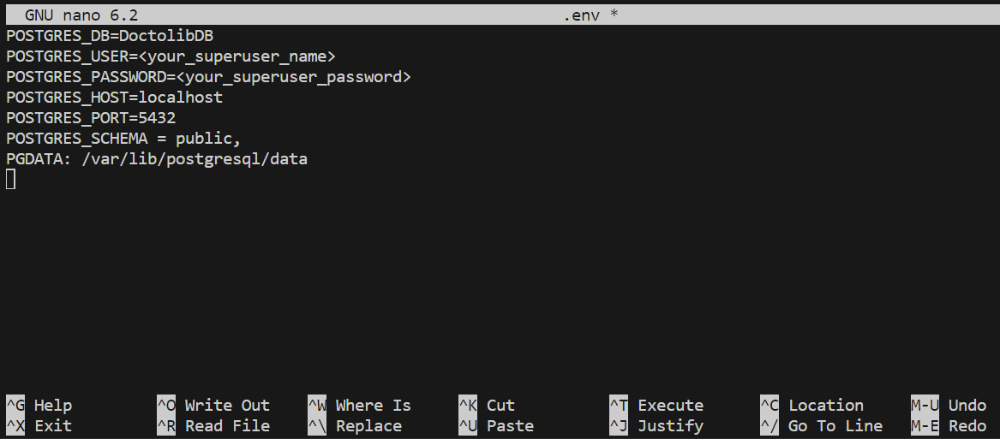
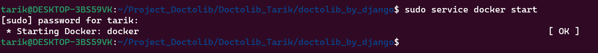
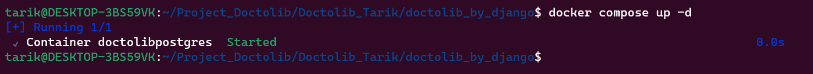
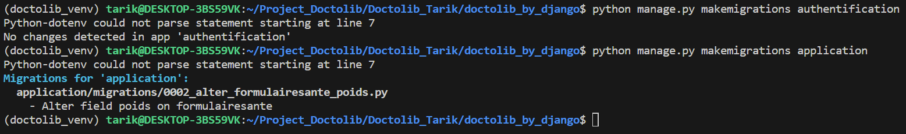
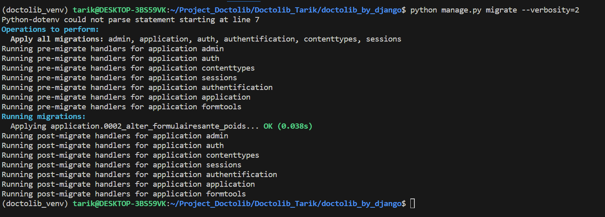
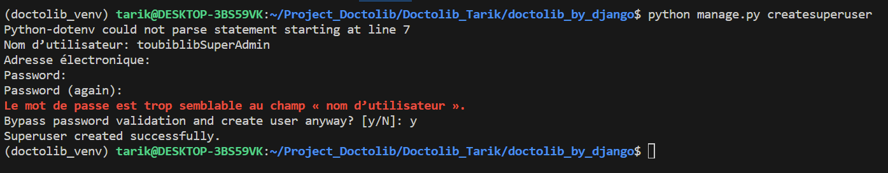

# README de l'Application Django Toubiblib

## Aperçu

Cette application Django est conçue pour à un collectif Médical, afin de lui octroyer la possibilité de collecter et annalyser des donnés de patients.


## Fonctionnalités

1. Un système de création de comptes et connexion

2. un moyen de Collect de données patients via deux formulaire:
- Formulaire de santé général
- Formulaire de niveau de stress

3. Une gestion de ces données:
- Création d'utilisateurs avec rôle (Admin, Medecin, Patient) et droits d'accés diférents pour chacun.
- Lecture des données des formulaires remplis avec filtrage des patients en fonctions des associations.
- Mise à jour des données des patients (Médecin uniquement).
- Suppression des données des patients (Médecin uniquement).

4. Une Annalyse exploratoire des données aux travers de graphiques avec filtrage des patients en fonctions des associations.

5. Un modèle IA pour prédire temporellement la situation médicale d'un patient (Pour la V2)

## Table des matières

1. [Installation](#installation)
2. [Utilisation](#utilisation)
3. [Vues](#vues)
    - [Vue Accueil](#vue-accueil)
    - [Vue Menu](#vue-menu)
    - [Vue Historique](#vue-historique)
    - [Vue Edaia](#vue-edaia)
    - [Vue Comptes](#vue-comptes)
    - [Vue Association Admins Comptes](#vue-association-admins-comptes)
    - [Vue Association Médecin-Patient](#vue-association-médecin-patient)
    - [Formulaire de Santé Multi-étapes](#formulaire-de-santé-multi-étapes)
    - [CRUD Formulaire de Santé](#crud-formulaire-de-santé)
4. [Licence](#licence)

## Installation

1. Clônez ce dépôt sur votre machine locale :

```bash
$ git clone https://github.com/data-IA-2022/Doctolib_Tarik.git
$ cd <nom_du_dépôt>
```
2. Créer et activer un environement virtuel :

```bash
$ python -m venv  <environment name> 
$ source . <environment name>/bin/activate
```

3. Installation des dépendences :

```bash
$ pip install -r requirements.txt
```

4. Créer un fichier environement pour connexion à la bdd :

```bash
$ nano doctolib_by_django/.env
```


5. Lancer docker :

```bash
$ sudo service docker start
```


6. Lancer docker compose :

```bash
$ docker-compose up -d
```


7. Faire les migrations (Créations des tables dans la Bdd):

```bash
$ python manage.py makemigrations authentification
$ python manage.py makemigrations application
$ python manage.py migrate --verbosity=2
```




8. Créer un superuser sur django :

```bash
$ cd doctolib_by_django
$ python manage.py createsuperuser
```



## Utilisation

A la première connexion en tant que superadmin aller dans la vue Comptes dans Création & Associations pour générer des comptes utilisateurs:
Selectionner un mnombre de comptes et ensuite les rôles.
**Important :** Pour que cette application Django fonctionnent avec les données générées par les scripts présent dans :
doctolib_by_django/application/management
Il vous faut dans cet ordre:
- 2 comptes Admin
- 4 comptes Medecin
- 16 comptes Patient.

## Vues

### Vue Accueil

- [Expliquez ce que fait la vue `accueil` et son objectif.]

### Vue Menu

- [Expliquez ce que fait la vue `menu` et son objectif.]

### Vue Historique

- [Expliquez ce que fait la vue `historique` et son objectif. Incluez des informations sur la récupération et l'affichage des données.]

### Vue Edaia

- [Expliquez ce que fait la vue `edaia` et son objectif. Incluez des informations sur les rôles des utilisateurs et la visualisation des données.]

### Vue Comptes

- [Expliquez ce que fait la vue `comptes` et son objectif. Incluez des informations sur la génération de comptes.]

### Vue Association Admins Comptes

- [Expliquez ce que fait la vue `associationAdminsComptes` et son objectif. Incluez des informations sur l'association d'admins avec des comptes d'utilisateurs.]

### Vue Association Médecin-Patient

- [Expliquez ce que fait la vue `associationMedecinPatient` et son objectif. Incluez des informations sur l'association de médecins avec des patients.]

### Formulaire de Santé Multi-étapes

- [Expliquez ce que fait la vue `formulaire_sante_gen` et son objectif, en particulier la fonctionnalité du formulaire à plusieurs étapes.]

### CRUD Formulaire de Santé

- [Expliquez ce que fait la vue `crud_form_sante` et son objectif, y compris la mise à jour et la suppression des données du formulaire.]

## Test unitaire

Test avec pytest non fonctionnel (V1)